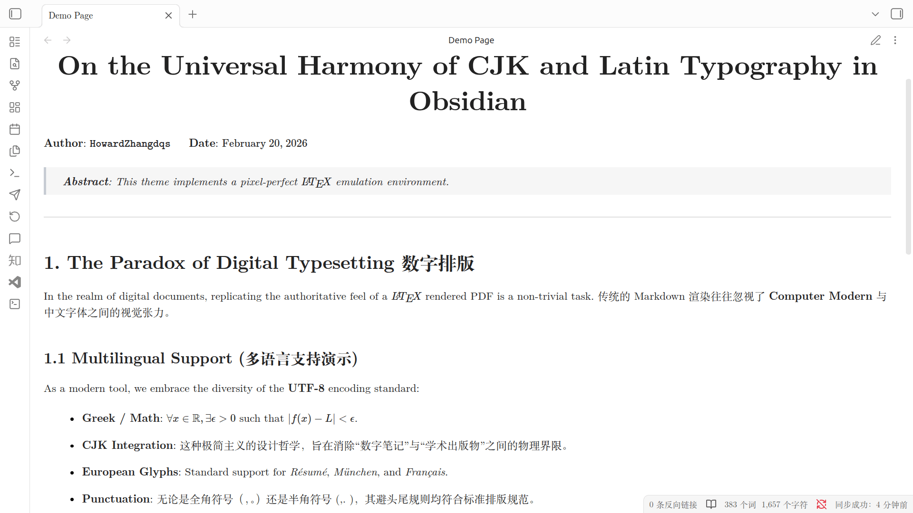

<div align="center">
  <h1>Latsidian - LaTeX Theme for Obsidian</h1>
  <p><a href="https://github.com/Howardzhangdqs/latsidian-source">Source Code Repo</a></p>
</div>

A clean, academic LaTeX-style theme for Obsidian. Perfect for mathematical writing, technical documentation, and Chinese content.



## Key Features

### LaTeX-Identical Typography

Uses **Latin Modern** as the default font — the exact same typeface used in standard LaTeX documents. Additional options include:

- **Latin Modern** — LaTeX default
- **Libertinus** — Open-source math font
- **Times New Roman**
- **SimSun** (Chinese Song)

All fonts are embedded in CSS with no external dependencies — works perfectly offline.

### Specialized Code Font

Code blocks use **CMUNTT** (Computer Modern Typewriter) — the exact same typewriter font used in LaTeX documents. For Chinese code comments, **FandolFang** (Chinese FangSong) is specially integrated to ensure elegant rendering of Chinese text within code.

### Excellent Chinese Support

Specially designed for Chinese content:

- **FandolSong** for body text
- **FandolFang** for Chinese in code blocks
- Robust fallback chain: SimSun → 宋体 → Noto Serif SC → Source Han Serif SC

### LaTeX-Style Elements

Standard academic elements supported:

```markdown
> [!theorem] Theorem content
> [!lemma] Lemma content
> [!definition] Definition content
> [!proof] Proof content
```

## Installation

1. Download the latest release from the [Releases](https://github.com/Howardzhangdqs/latsidian) repo
2. Extract to your vault's `.obsidian/themes/` folder
3. Enable in **Settings → Appearance → Themes**

## Credits

- Inspired by [LaTeX.css](https://github.com/vincentdoerig/latex-css).

## License

MIT License
